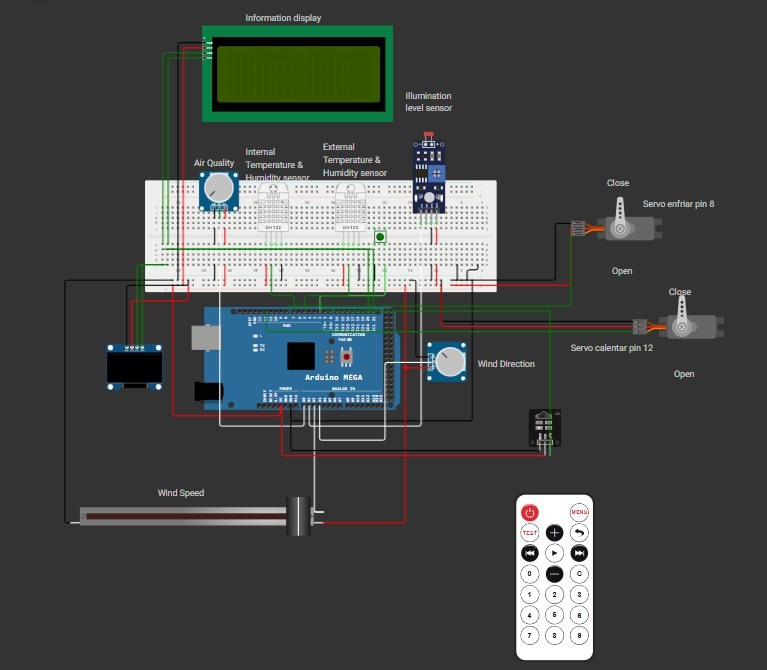

# Sistema de control y actuación en función del clima

Esta actividad es una **continuación de la Actividad 1**, en la cual se esbozó el diseño de una **boya climática** equipada con un conjunto de sensores destinados a medir las **condiciones climatológicas** y a ejecutar **acciones de control** dentro del sistema.

En esta **Actividad 2**, se ha **ampliado el sistema**, incorporando, además, **nuevos sensores** que permiten medir parámetros adicionales, tales como la **temperatura interna del sistema**. 

Asimismo, se han integrado **dos servomotores** que simulan la **apertura y cierre de compuertas**, los cuales están destinados al **control del sistema de refrigeración**.


## Sistema montado


<div align="center">
  
</div>

## Componentes empleados


A continuación se listan los componentes utilizados en el desarrollo del sistema:

- **Placa Arduino Mega**  
  Microcontrolador principal utilizado para gestionar todos los sensores y actuadores.

- **Pantalla LCD 20x4 con interfaz I2C**  
  Display de 4 líneas y 20 caracteres por línea, facilita la visualización de información del sistema.

- **2 Sensor DHT22**  
  Sensor digital de temperatura y humedad.

- **Pantalla OLED con interfaz I2C**  
  Panel gráfico para mostrar datos adicionales de forma compacta y clara.

- **Sensor de luminosidad LDR**  
  Sensor de resistencia variable según la luz ambiental.

- **Protoboard (placa de conexión)**  
  Para realizar conexiones rápidas y modulares entre componentes.

- **Potenciómetro deslizante (Slide Potentiometer)**  
  Utilizado para introducir valores analógicos ajustables.

- **2 Servomotor**  
  Actuador que simula la apertura y cierre de compuertas del sistema de refrigeración.

- **2 Potenciómetro rotativo (Knob-controlled linear potentiometer)**  
  Resistencia variable controlada mediante perilla, usada para ajustes manuales.

## Desarrollo Software


### Estructura Modular del Software

El software se ha dividido en **seis módulos principales**, cada uno encargado de gestionar un subconjunto específico de sensores o actuadores. Esta organización permite una mayor claridad en el código y facilita tanto su mantenimiento como su ampliación.

A continuación se describen brevemente las funciones de cada módulo:

#### `LDR.ino`

Este módulo gestiona el sensor de luminosidad (LDR). Contiene las siguientes funciones principales:

- `readLdr()`: Convierte el valor analógico del sensor en una unidad de **iluminancia (lux)**.
- `updateLDR()`: Muestra en el **display LCD** los datos obtenidos por el sensor.

#### `AirQualiti.ino`

Este módulo gestiona uno de los dos potenciometro rotativos encargado de proporcionar una medida para la calidad del aire. Contiene las siguientes métodos:

- `readAirQuality()`: Compara el valor analógico del sensor con valores previamente definidos dentro de los estandares de "Bueno, Malo, Moderado".
- `updateAirQuality()`: Muestra en el **display LCD** los datos obtenidos por el sensor

#### `Wind.ino`

Este módulo gestiona el otro pontenciometro rotativo y el potenciómetro lineal encargado de proporcionar una medida para la direccion y velocidad del viento. Contiene las siguientes métodos:

- `readWind()`: lee dos entradas analógicas: una para la **velocidad del viento** (escalada de 0 a 100) y otra para la **dirección**, mapeando el valor a un **ángulo entre 0° y 359°**.  Según el ángulo, se asigna un punto cardinal (N, NE, E, etc.); 
- `uupdateWind()`: Muestra en el **display LCD** los datos obtenidos por el sensor

#### `Servo.ino`

Este módulo gestiona uno de los dos potenciometro rotativos encargado de proporcionar una medida para la calidad del aire. Contiene las siguientes métodos:

- `servo (float status)`: controla dos servomotores en función de la **temperatura interna** (`status`).Si la temperatura supera un umbral máximo (`tempMax`), se **abre la compuerta de refrigeración** (`servoCold`) y se **cierra la de calefacción** (`servoHot`).Si la temperatura es inferior al umbral mínimo (`tempMin`), se hace lo contrario: se **activa la calefacción** y se **cierra la ventilación**.  En caso contrario (temperatura en rango adecuado), ambos servos permanecen en posición cerrada.


#### `Bateria.ino`

Este módulo gestiona uno de los dos potenciometro rotativos encargado de proporcionar una medida para la calidad del aire. Contiene las siguientes métodos:

- `mostrarBateriaOLED(float bateria)`: Primero imprime el texto `"Bateria: XX%"` y luego dibuja un rectángulo que se rellena proporcionalmente al valor de `bateria` (de 0 a 100), simulando un **indicador gráfico de carga**.

#### `Temperatura_humedity.ino`
Este módulo es encargado de gestionar los dos sensores DHT22 para el control de la temperatura y de la humedad. Contiene las siguientes métodos:

- `readDHT(float* temperature, float* humidity, int sensor)`: permite leer temperatura y humedad desde uno de los **dos sensores DHT22** disponibles. La variable `sensor` indica cuál usar: si es `1`, se lee del sensor **exterior** (`dhtExt`); en caso contrario, se lee del **interior** (`dhtInt`).Los valores leídos se almacenan en los punteros `temperature` y `humidity`, y si alguna lectura falla, se muestra un mensaje de error por el monitor serie.
- `updateDHT()`: Muestra en el **display LCD** los datos obtenidos por el sensor

#### `LCD.ino`
Este módulo se encarga de **mostrar y actualizar en tiempo real los datos en la pantalla LCD**. También define varios **iconos personalizados** que enriquecen la visualización. Las funciones principales que contiene son:

- `showScreen(int index)`: Muestra una pantalla distinta en función del índice recibido:
  - **Pantalla 0**: Temperatura y humedad interna y externa, usando íconos de sol y gota.
  - **Pantalla 1**: Velocidad y dirección del viento, con flechas direccionales generadas dinámicamente según la orientación.
  - **Pantalla 2**: Estado de calidad del aire.
  - **Pantalla 3**: Nivel de luminosidad, acompañado de un icono de bombilla.

- `updateScreen(int index)`: Se encarga de **actualizar solo los valores que han cambiado** desde la última visualización, evitando el parpadeo o escritura innecesaria. Esto mejora el rendimiento y hace la interfaz más fluida y estética. Compara valores actuales con los últimos registrados en variables como `lastTemperatureExt`, `lastWindSpeed`, `lastLux`, etc.

- `direccionCardinal(int direccion)`: Asocia un valor numérico de dirección del viento con su correspondiente **punto cardinal (N, NE, E, etc.)** y crea en el LCD un **carácter personalizado con forma de flecha** para representar gráficamente esa dirección.

Además, el módulo define **iconos personalizados en forma de matrices de bytes**, como bombilla, sol, gota de agua y flechas, los cuales se cargan en el LCD con `lcd.createChar()` y se muestran junto a los datos para mejorar la interfaz visual.


### Integración en el main o módulo principales

### Funcionamiento del `loop()`

La función `loop()` es el núcleo del sistema, donde se ejecutan las tareas de forma continua. 

#### Lógica de Lectura de Sensores

Para evitar lecturas constantes que saturen el sistema  cada sensor tiene asociado un **intervalo de actualización específico** (por ejemplo, `DHT_INTERVALExt`, `LDR_INTERVAL`, etc.). 

La lógica seguida es:

1. Se toma el **tiempo actual** con `millis()`.
2. Se compara con la **última vez** que se leyó el sensor.
3. Si la diferencia supera el **intervalo definido**, se ejecuta la lectura y se actualiza la marca de tiempo.


#### Ejemplo de flujo para cada sensor:

```cpp
if (currentMillis - lastDHTReadExt >= DHT_INTERVALExt) {
  readDHT(&temperatureExt, &humidityExt, 1);
  lastDHTReadExt = currentMillis;
}
```

Este patrón se repite para todos los módulos, como:

- `readDHT()` – Sensor de temperatura y humedad (interior y exterior).
- `readLDR()` – Sensor de luz.
- `readAirQuality()` – Sensor de calidad del aire.
- `readWind()` – Sensor de velocidad y dirección del viento.
- `servo()` – Control de servomotores según la temperatura interna.

#### Cambio de pantalla

Además, el sistema monitorea la **interrupción por botón** para permitir al usuario cambiar entre diferentes pantallas en el LCD. Cuando se detecta una pulsación, se llama a `showScreen(index)` para actualizar la visualización según el tipo de sensor seleccionado.

#### Simulación de batería

El valor de batería (`bateria`) se ajusta dinámicamente dentro del `loop()` en función de las condiciones de luz (`lux`) y temperatura externa, simulando una lógica de carga/descarga.

---


## Discusión del Sistema Montado

En este proyecto se ha empleado una **placa Arduino Mega** como unidad central de control, debido a su gran número de pines y capacidad para manejar múltiples sensores de forma simultánea. El sistema simula el funcionamiento de una **boya climática**, que recoge información ambiental mediante diferentes sensores y realiza ciertas acciones automatizadas en función de los datos obtenidos.

### Control de Temperatura Interna y Comp puertas

El sistema cuenta con **dos sensores DHT22**: uno para medir la **temperatura y humedad exterior**, y otro para la **temperatura interna**. Este último es crucial para gestionar el **control térmico del sistema** a través de **dos servomotores**, que simulan la **apertura y cierre de compuertas**.

El control se realiza mediante la función `servo()`, que recibe la temperatura interna como parámetro. La lógica es la siguiente:

- Si la temperatura interna **supera un umbral máximo**, se activa el **servomotor frío** para **abrir una compuerta de ventilación**.
- Si la temperatura interna **desciende por debajo de un umbral mínimo**, se activa el **servomotor caliente** para **permitir la entrada de aire más cálido**.

### Visualización de Datos

El resto de sensores (como el sensor de luz LDR, el sensor de calidad del aire y el sensor de viento) no activan mecanismos físicos, pero su información es **mostrada en tiempo real en una pantalla LCD**, permitiendo al usuario monitorizar el entorno simulado de la boya.

### Simulación del Estado de Batería

El sistema también incluye una **simulación del estado de batería**, cuya carga o descarga depende de las condiciones ambientales:

- Si la **temperatura exterior es inferior a 0°C**, la batería **no se carga**, para simular una protección ante frío extremo.
- Si la **luminosidad supera los 600 lux**, valor que simula un **día soleado**, la batería se **carga progresivamente**.
- En condiciones contrarias (poca luz y temperatura baja), la batería **se descarga ligeramente** en cada iteración del `loop()`.

El porcentaje de batería actual se muestra en una **pantalla OLED**, que aporta un diseño más estético y moderno al sistema.

### Controlador IR de la pantalla LCD I2C _(Actividad 3)_

Se han añadido al proyecto un receptor IR, que sus tres pines están conectado a:

- El pin GND se ha conectado a tierra.
- El pin VCC se ha conectado a la alimentación de 5 voltios.
- El pin DAT se ha conectado a al pin 1 digital.

El funcionamiento que hemos descrito para este dispositivo se encuentra en la función `translateIR()` que a su vez está en el archivo **_IRemote.ino_**. El funcionamiento es el siguiente.

Se han descrito el funcionamiento para los siguientes botones: Los número 1; 2; 3 y 4, el botón de power y los botones de adelantar y rebobinar. El funcionamiento de los botones será el siguiente:

- **Los números**: Cada número tiene asignada una pantalla. En el caso del número 1 mostrará la humedad y temperatura interior y exterior, en el caso del número 2 mostrará los datos del viento (velocidad en km/h y la dirección de este), el botón 3 mostrará la calidad del aire y el botón 4 mostrará el la luminosidad de exterior.

- **Botón power**: Al pulsar este botón se apagará pantalla en el caso de que la pantalla estuvierá encendida y en caso contrario si estuviera apagada. La pantalla que se muestra al encenderla es la última que estaba muestrando la pantalla.

- **Botones de adelante y rebobinar**: En este caso si pulsamos el botón de adelante nos llevará a la siguiente pantalla y si pulsamos el botón rebobinar nos llevará a la pantalla anterior. En el caso de hacer una vuelta completa por todas las pantallas nos llevará a la primera pantalla en el caso de la última y habiendo dado al botón adelante y a la última si pulsamos el botón rebobinar desde la primera pantalla.

#### Video mostrando el funcionamiento del receptor IR.
[Video funcionamiento](Img/funcionamiento.mp4)


---

## Acceso al Proyecto en Wokwi

Dentro del repositorio, en la misma rama **`MAIN`**. En dicha rama se encuentra un archivo empaquetado `.zip` llamado **`Actividad2_entrega`**.

Al descomprimirlo, contiene un fichero llamado `wokwi-project.txt` que incluye la URL para acceder directamente al proyecto en la plataforma de simulación **Wokwi**.

Por comodidad, también se puede acceder directamente haciendo clic en el siguiente enlace:


👉 [Abrir simulación en Wokwi](https://wokwi.com/projects/434117026771162113)
## Autores


- Daniel Gallardo Martín
- Irene Bejerano Nombela
- Pilar Berzal Gómez
- Alberto Ávila Fernández

